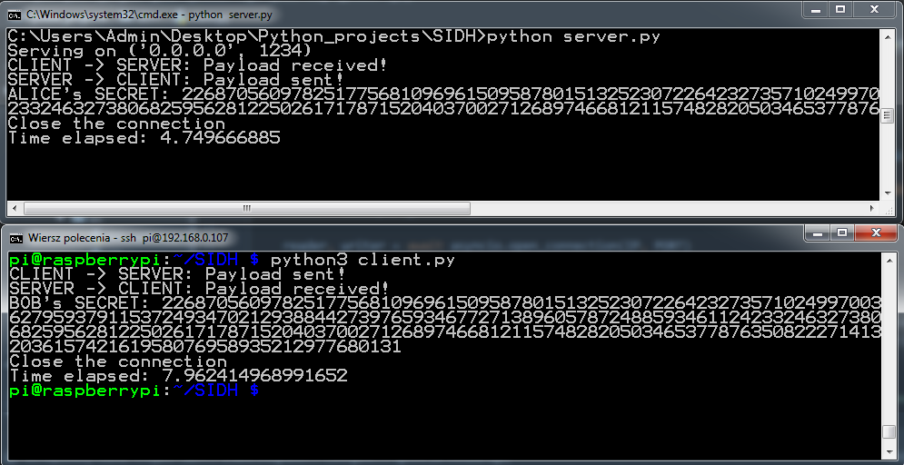

This archive contains implementation of the Supersingular Isogeny Diffie-Hellman protocol using Cypari python library.
It was implemented on Windows 7 Ultimate 64bit OS, but it was designed to work also on low resource device, Raspberry Pi Zero W with Raspbian OS.
Tested with Python 3.7 and 3.8.



## Description
- Information about the SIDH protocol:\
[*SIDH key exchange*](https://en.wikipedia.org/wiki/Supersingular_isogeny_key_exchange) *on Wikipedia*\
[*Presentation*](https://ecc2017.cs.ru.nl/slides/ecc2017school-costello.pdf) *and* [*paper*](https://eprint.iacr.org/2019/1321.pdf) *by Craig Costello from Microsoft Research*

- Core functions can be found implemented in `src/sidh.py`

- `sidh_protocol.py` is an example of protocol execution on single machine, simulating both parties, Alice and Bob.

- `server.py` and `client.py` are the example implementation of SIDH key exchange between server (running on PC) and a client (running on Raspberry Pi). When server script is executed, it listens for connection on port 1234. When client script is executed, it opens connection to the server, computes public key and send it in JSON form, along with protocol name and chosen parameters set. Server receives the key and computes his own public key, sends it to client, and both parties compute their secret keys. After it is done, secret keys are printed and the connection is closed.
Because computations of degree-3 isogenies are faster, client (Raspberry Pi) always plays the role of Bob (3-isogenies), and server (PC) always play the role of Alice (2-isogenies).

- `sidh_isogeny_benchmark.py` was used to generate optimal strategy for isogeny computation on Raspberry Pi and PC, which were hardcoded later.

## Usage
To download the repository, enter:
```
git clone https://github.com/kamsec/SIDH.git
```
In order to use it, Python 3.7+ has to be installed.

a) On Windows:

1. Install PARI/GP version 2.13.1+

2. Install requirements (Cypari) with:
    ```
    pip install -r requirements.txt
    ```

3. It should be possible to run all scripts with python, eg.
    ```
    python server.py
    ```


b) On Raspberry Pi (Raspbian):

1. Install python3-cypari2 (https://debian.pkgs.org/11/debian-main-arm64/python3-cypari2_2.1.2-2_arm64.deb.html)
    ```
    sudo apt-get install python3-cypari2
    ```

2. It should be possible to run all scripts with python3, eg.
    ```
    python3 client.py
    ```

You might need to add firewall exceptions if using it between two devices.
## Configuration

- `sidh_protocol.py` has function of the same name which takes as arguments values from config dictionary.
Possible values are listed as comments next to dictionary items initialization, and they are:

        'params_name': "SIKEp434",  # 'small', 'medium' 'SIKEp434'
        'print_all': False,  # True, False - for visualiation when using 'small' params
        'k_A': None,  # :int: - Alice can choose a secret for testing (currently inside the function)
        'k_B': None,  # :int: - Bob can choose a secret for testing (currently inside the function)
        'p_cost': 100,  # :int: - multiplication cost for optimal_strategy uses precomputed value
        'q_cost': 120,  # :int: - isogeny cost for optimal_strategy (uses precomputed value)
        'walk': 'isogeny_walk',  # 'isogeny_walk', 'optimal_strategy'


- `client.py` has function with the following possible arguments:

        params_name='SIKEp434'  # 'small', 'medium' 'SIKEp434'
        walk='optimal_strategy'  # 'isogeny_walk', 'optimal_strategy'
        side='BOB',  # 'BOB' - implemented only for BOB side because of 3-degree isogenies efficiency
        print_all=False  # True, False

- Ip adress and port to which client will try to connect, can be set as contants:

        IP = '192.168.0.101'
        PORT = 1234

- `server.py` has function with the following possible arguments:

        walk='optimal_strategy'  # 'isogeny_walk', 'optimal_strategy'
        side='ALICE',  # 'ALICE' - implemented only for ALICE side because of 2-isogenies are more time-consuming
        print_all=False  # True, False

- Server cannot choose `params_name` because the choice of the parameters set is decided by the client.

- Port which server uses, can be set as a constant:

        PORT = 1234

- `sidh_isogeny_benchmark.py` in main function has the variables:
        
        max_range_1 = 11  # :int: - range of checked q_cost values, in choosing optimal strategy for isogeny computation
        max_range_2 = 3   # :int: - amount of sidh executions with chosen strategy

